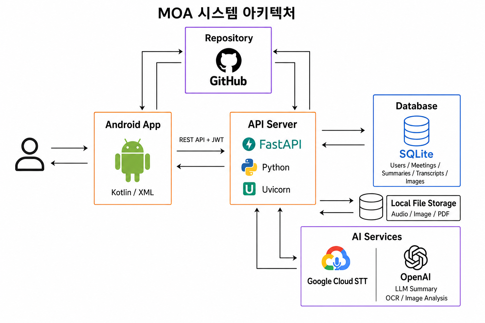

# MOA

<div align="center">

</div> 

MOA(Multimodal Orchestrated Assistant **(모아)** — 회의 음성·문서·이미지를 모아 AI가 요약·결정 사항·할 일까지 정리해 주는 모바일 회의 관리 서비스입니다.

  
> 회의를 기록하는 시간을 줄이고, 회의의 가치를 높이다.

  

**한성대학교 모바일소프트웨어트랙 캡스톤디자인 · 연대기팀** · 개발 기간 2026.03.05 ~ 2026.06.05


---

## 기술 스택


### Android 클라이언트

[](https://developer.android.com)
[](https://kotlinlang.org)
[](https://developer.android.com/guide/navigation)

### 백엔드·AI

[](https://www.python.org/)
[](https://fastapi.tiangolo.com/)
[](https://www.sqlite.org/)
[](https://jwt.io/)
[](https://platform.openai.com/)
[](https://cloud.google.com/speech-to-text)

---

## 프로젝트 디렉토리

저장소 루트 기준 주요 구조입니다.

```text
MOA/
├── app/                          # Android 애플리케이션
│   └── src/main/
│       ├── java/.../a20260310/
│       │   ├── MainActivity.kt   # NavHost + 드로어 네비게이션
│       │   ├── data/             # remote(API)·local·repository·model·auth·poll
│       │   ├── ui/               
│       │   ├── viewmodel/
│       │   └── worker/           # 요약 완료 폴링 등 WorkManager
│       └── res/
│           ├── navigation/       # nav_graph.xml
│           ├── layout/, menu/, values/
│           └── ...
├── backend/                      # FastAPI API 서버 (Python)
│   └── app/
│       ├── main.py
│       ├── routers/, services/, repositories/, models/
│       ├── ai/                   # STT 연동, 요약, OCR 등
│       ├── config/, storage/, utils/
│       └── ...
└── ...
```

---

## 주요 기능


| 구분    | 내용                                              |
| ----- | ----------------------------------------------- |
| 회의·폴더 | 폴더 단위로 회의 구분, 목록·상세에서 일정·상태 확인                  |
| 입력 소스 | 문서(PDF·이미지)·오디오 업로드, 기기 녹음, ML Kit 문서 스캔        |
| AI·요약 | 서버 STT·문서·이미지 처리 후 요약·결정 사항·할 일(Action Item) 생성 |
| 요약 UX | 진행률·예상 시간, 요약 대기 큐, WorkManager 백그라운드 폴링        |
| 회의 상세 | 요약·결정·할 일 편집, 첨부 파일 탭·다운로드                      |
| 인증    | JWT 기반 로그인·회원가입                                 |


---

## 시스템 아키텍처

팀에서 정의한 전체 시스템 구성입니다. Android 클라이언트는 **REST API + JWT**로 백엔드와 통신하고, 백엔드는 **SQLAlchemy**로 **SQLite(로컬 기본)** 또는 **MySQL**에 메타데이터를 저장하고, 로컬 파일 저장소·**외부 STT 서버(HTTP)**·**OpenAI** 등과 연동합니다.

<div align="center">
  
</div>

사용자는 Android 앱에서 회의 자료를 올리고, API 서버가 메타데이터와 파일을 저장한 뒤 AI 서비스로 분석·요약 결과를 받아 다시 앱에 전달하는 흐름으로 동작합니다.

---

## 앱 화면

| 화면 | 역할 |
| --- | --- |
| `HomeFragment` | 메인: 회의 목록, 요약 패널, 회의 추가·상세로 진입 |
| `DetailFragment` | 회의 상세(요약·결정·할 일·첨부 파일) |
| `AddMethodFragment` → `SummarizingFragment` → `SummaryFragment` | 자료 등록 후 요약 진행·결과 확인(필요 시 `RecordingFragment`에서 녹음) |
| `LoginFragment` / `SignupFragment` | 로그인·회원가입 |
| `SettingsFragment` | **설정**, 로그아웃 |

## 팀 (연대기)


| 이름  | 역할                                  |
| --- | ----------------------------------- |
| 신현규 | 팀장, LLM (AI 모델 최적화 및 UI 인터페이스 설계)       |
| 김민서 | Android Frontend / UI · UX          |
| 오형채 | Backend (API 연동 서버 구축 및 DB 아키텍처 설계) |
| 박민혁 | STT (API 연동 및 서버 인프라 관리)            |


---

한성대학교 모바일소프트웨어트랙 캡스톤디자인 프로젝트입니다.
